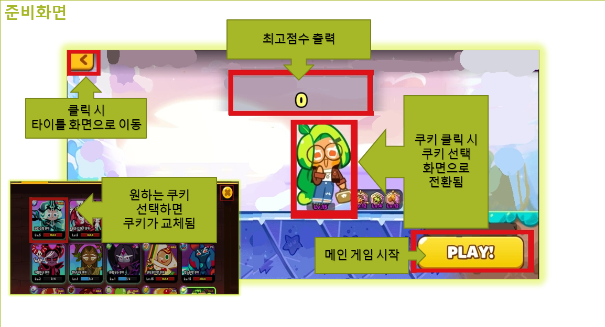
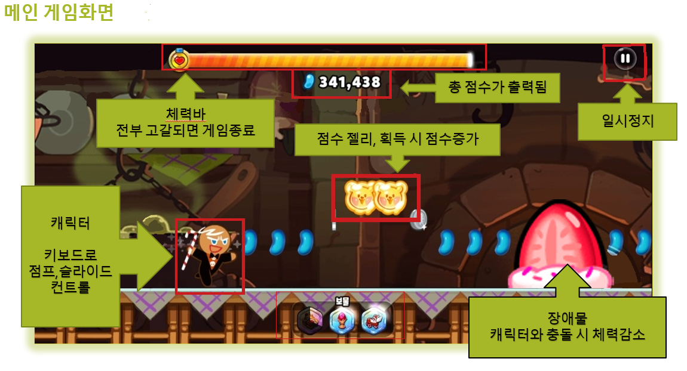
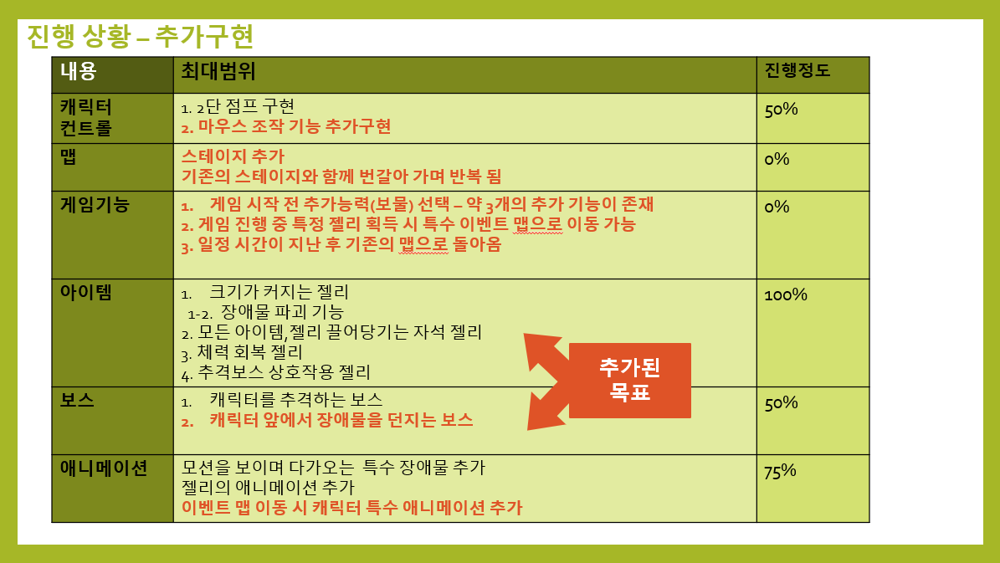
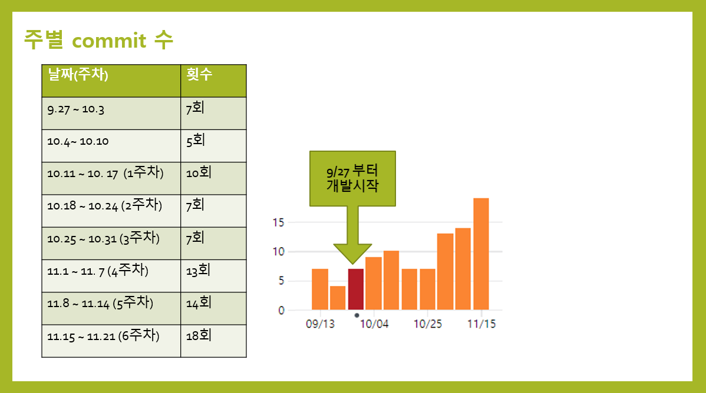
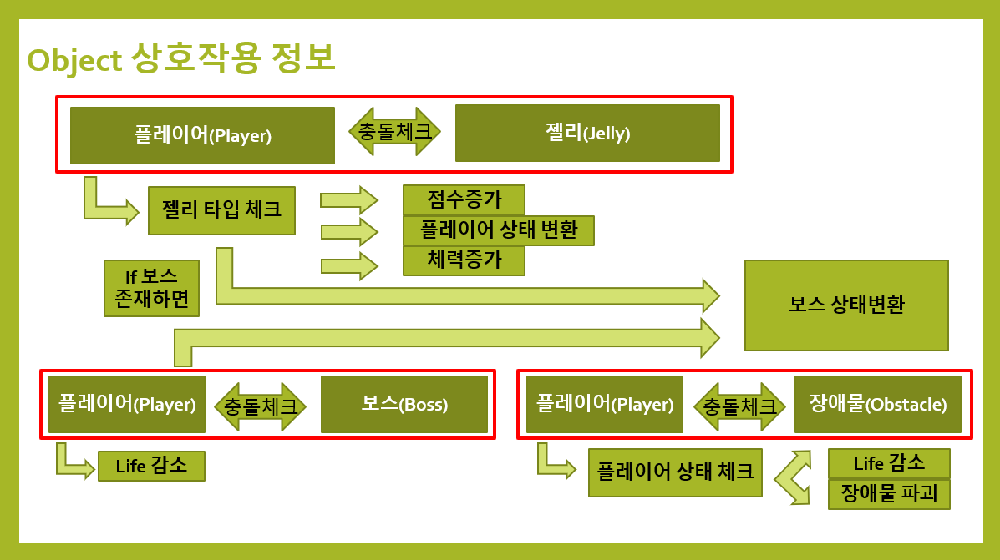
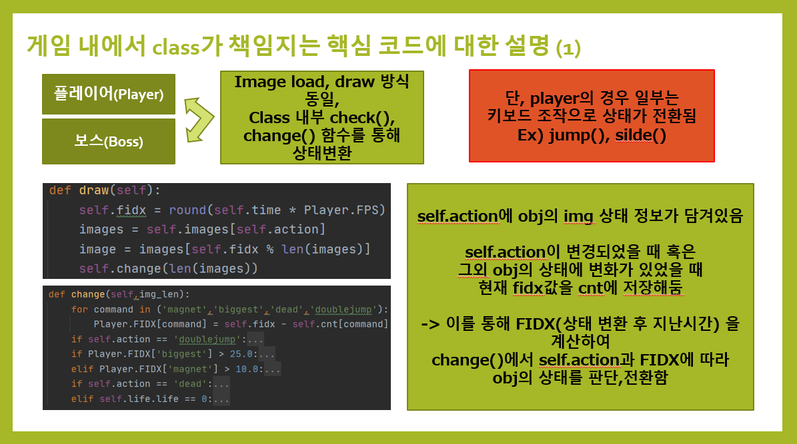
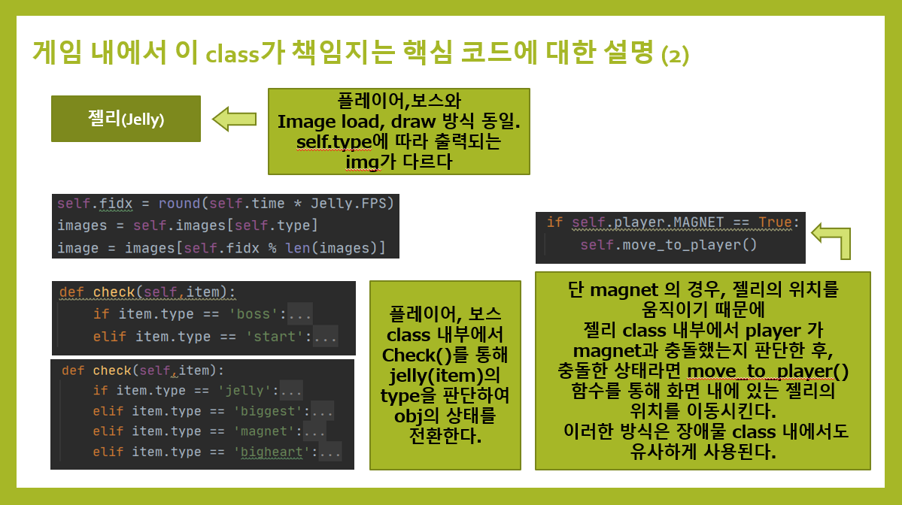

# 1. 게임의 소개
 * 게임 제목
    * 미니 쿠키런 (*미니런* )
 * **쿠키런:오븐브레이크** 의 카피 게임
   > * 원 게임에 대한 설명
   >    * **횡스크롤 러닝 게임**이다. 
   >    * 원하는 쿠키를 사용하여 맵을 달린다.
   >    * 달리는 동안 젤리를 먹어 점수를 얻는다.
   >    * 각 쿠키는 **체력**이 존재하며, 시간이 지날수록 체력이 감소한다.
   >    * **장애물에 부딪힐 경우 체력이 크게 감소**한다.
   >    * **체력이 0이 될 경우 게임은 종료**된다.
   >    * 종료 시 결과 화면이 나오며, 본인의 총 점수가 나온다.
   > * 스크린샷  
   >   
   >   
   >   
 * 게임의 목적 및 방법
    * **목적**
        * 두 가지의 경우를 고려하고 있음
         1) 게임에서 최대한 오래 살아남는 것
            * 게임 진행화면 상단에 쿠키가 생존한 시간이 출력된다.
            * 게임 종료 시 총 생존시간이 출력된다.
         2) 게임에서 최대한 높은 점수를 얻는 것
            * 게임 진행화면 상단에 쿠키의 점수가 출력된다.
            * 게임 종료 시 총 점수가 출력된다.
                * 이 경우, 맵에 젤리가 생성된다.
    * **방법**
        * 게임 시작 전, 원하는 쿠키를 선택한다.
        * 게임시작 버튼을 누르면 게임이 시작된다.
        * 쿠키를 슬라이드, 점프로 조작할 수 있다.
        * *달리는 동안 젤리를 먹어 점수를 얻는다.*
        * 화면 상단에 체력바가 표기된다.
        * 각 쿠키는 **체력**이 존재하며, 시간이 지날수록 체력이 감소한다.
        * **장애물에 부딪힐 경우 체력이 크게 감소**한다.
        * **체력이 0이 될 경우 게임은 종료**된다.
        * 키보드 키 입력/정지버튼 클릭으로 도중 게임을 중단할 수 있다.
        * 종료 시 결과 화면이 나오며, 본인의 총 점수가 나온다.
        * 결과 화면에서 총 점수를 확인한 뒤 준비화면으로 돌아간다.
        * 반복해서 게임을 플레이 할 수 있다.
        
    * 추가적으로 구현하고 싶은 것
        * 원하는 보물 1개를 선택할 수 있다.
            2) 스케이트 - 쿠키의 속도가 빨라진다.
            3) 붉은 알 - 쿠키가 한번 부활할 수 있다.
            3) 엔진 - 쿠키의 속도가 점점 빨라지며, 일정 속도가 되면 보호막이 생긴다.
            장애물과 부딪히면 보호막은 사라지고, 속도가 기본 속도로 감소한다.
        * 보너스 젤리
            1) 획득하면 보너스 맵으로 이동한다.
            2) 쿠키는 해당 맵에서 다른 애니메이션으로 행동한다.
            3) 일정 시간이 지나면 원래 맵으로 돌아온다.
        * 추가적인 맵(스테이지) 구현
            1) 일정 거리를 이동했을 시 장애물과 배경 이미지가 변경된다.
        * 추가 장애물,젤리 구현
            1) 장애물과 쿠키의 거리가 가까워 졌을때, 애니메이션을 취하는 장애물
            2) 애니메이션하는 장애물, 젤리
            3) 움직이는 젤리
            4) 자석젤리 - 획득 시 쿠키가 모든 젤리들을 끌어당김
            5) 크기젤리 - 획득 시 쿠키의 크기가 커지며 장애물 파괴가 가능해짐
                장애물 파괴: 장애물이 파괴되면 화면밖으로 장애물이 날아간다.
            6) 체력회복 젤리 - 획득 시 쿠키의 체력이 회복된다.
            7) 시작젤리, 보스젤리 - 추격보스와의 상호작용에 사용된다.
        * 보스 구현
        1) 추격보스
            1) 쿠키가 시작젤리를 획득하면 보스가 깨어난다.
            2) 깨어난 보스는 서서히 쿠키에게 다가온다.
            3) 만약 보스가 쿠키와 부딪히면 보스는 쓰러진다.(공격성공)
            4) 쿠키는 보스젤리를 획득하여 보스를 공격해야 한다.
            5) 공격이 성공했을 때 점수를 획득하며, 보스는 잠시 멈춘다.
            6) 공격을 일정 횟수 성공시키면 보스는 죽는다.
        2) 공격보스
            1) 쿠키의 앞에 나타며, 위아래로 계속 움직인다.
            2) 쿠키를 향해서 장애물을 던진다.
            3) 쿠키가 일정 거리 이상 이동하면 보스는 물러난다.
        * 사운드
            1) 각 각 장면 별 배경음악
            2) 캐릭터 점프, 슬라이드, 충돌 사운드
        * 캐릭터의 2단점프 구현
            1) 2단 점프 시 쿠키가 회전한다.
        * 화면전환/캐릭터 컨트롤이 마우스/키보드조작 모두 가능하도록 추가
          
        

        
# 2. Scene의 수 및 이름
* 5개 *(추가 구현시 6~7개)* 
    - 타이틀 화면
    - 게임 준비 화면
    - 게임 플레이 화면(메인 게임화면)
    - 쿠키 선택화면
    - *보물 선택화면*
    - *보너스 맵 화면*
# 3. Scene별 구체적인 설명
* **타이틀 화면**
    * 게임을 실행시켰을 때 처음 나오는 화면
    * 다른 화면으로 전환 방법
        * 키보드 키 입력
            - 이미지 로드가 전부 완료되면 키보드 입력이 가능해진다.
        
* **게임 준비 화면**
    * 게임 시작 전 쿠키/*보물*을 설정하는 화면
    * 화면에 표시할 객체들의 목록
        - 쿠키
        - 시작 버튼
        - 뒤로가기 버튼
        - 최고점수 표기 바
        - *보물*
    * 처리할 마우스 이벤트
        * 쿠키 클릭
        * 게임시작 버튼 클릭
        * *보물 클릭*
    * 다른 화면으로 전환 방법
        * 쿠키 클릭 시 쿠키 선택화면으로 전환됨
        * *보물 클릭 시 보물 선택화면으로 전환됨*
        * 시작 버튼 클릭 시 게임 플레이 화면으로 전환됨
        * 뒤로가는 버튼 클릭 시 타이틀 화면으로 이동
        
* **쿠키 선택화면**
    * 플레이할 쿠키를 선택하는 화면
    * 화면에 표시할 객체들의 목록
        * 각 쿠키들의 이미지
        * X버튼
    * 처리할 마우스 이벤트
        * 쿠키 클릭
        * 화면 상단 X버튼 클릭
    * 처리할 키보드 이벤트
        * 좌,우 키보드로 목록에 있는 쿠키 전환
        * enter로 쿠키 선택
    * 다른 화면으로 전환 방법
        * 마우스로 목록에 있는 쿠키 선택
        * enter로 쿠키 선택
        * 화면 상단의 X버튼 클릭
        
* **보물 선택화면**
    * *착용할 보물을 선택하는 화면*
    * *화면에 표시할 객체들의 목록*
        * *각 보물들의 이미지*
        * *X버튼*
    * *처리할 마우스 이벤트*
        * *보물 클릭*
        * *화면 상단 X버튼 클릭*
    * *처리할 키보드 이벤트*
        * *좌,우 키보드로 목록에 있는 보물 전환*
        * *enter로 보물 선택*
    * *다른 화면으로 전환 방법*
        * *마우스로 목록에 있는 보물 선택*
        * *enter로 보물 선택*
        * *화면 상단의 X버튼 클릭*
        
* **게임 플레이 화면(메인 게임화면)**
    * 본 게임을 플레이 하는 화면
        - 장애물, 젤리 객체의 위치가 정해져 있음
        - 시간이 지나면서 객체와 배경이미지가 캐릭터의 방향으로 다가옴
        - 장애물, 젤리객체와  배경이미지를 통틀어 하나의 맵(스테이지)이라고 칭함
        - 맵은 구간마다 반복됨
    * 화면에 표시할 객체들의 목록
        * 쿠키
        * 장애물
        * 젤리
        * 체력 바
        * 점수/시간 출력 바
        * 일시정지 버튼
        * 정지/재시작 버튼(일시정지 클릭 시 발생)
    * 처리할 키보드 이벤트
        * 스페이스 바 - 점프
        * 아래 방향키 - 슬라이드
        * Q - 게임 중단
    * 처리할 마우스 이벤트
        * 일시정지 버튼 클릭
    * 다른 화면으로 전환 방법
        * Q버튼 입력 - 결과 화면으로 전환됨
        * 일시정지 버튼 클릭 후 정지버튼 클릭
        
* **보너스 맵 화면**
    * 장애물이 없는 보너스 맵
    * 화면에 표시할 객체들의 목록
        1) 목적 1)의 경우
            * 체력 회복 젤리
        2) 목적 2)의 경우
            * 점수 젤리
    * 처리할 키보드 이벤트
        * 위, 아래 방향키
    * 다른 화면으로 전환 방법
        * 일정 시간이 지날 경우
        
* **결과 화면**
    * 게임 플레이 결과를 출력하는 화면
    * 화면에 표시할 객체들의 목록
        * 점수/시간 출력 바
        * 확인 버튼
    * 처리할 마우스 이벤트
        * 확인 버튼 클릭
    * 다른 화면으로 전환 방법
        * 확인 버튼 클릭 시 준비화면으로 전환됨
        
* 기본 화면전환 루트  
 ┌<──────────────────┐  
 준비화면 - 플레이 화면 - 결과 화면  
 └ 보물 선택화면  
 └ 쿠키 선택화면
* 이미지 예시
 >   
 >   
 >   
 
# 4. 필요한 기술
* 장애물 충돌체크
* 객체의 움직임과 관련한 기술들
* 애니메이션 관련 기술들
* GameState, gfw 관련 배운내용
* 시간 측정

# 5. 개발 일정
   >   

# 6. 2차발표 자료
   >   
   >   
   >    
   >   
   >   
   >   
   > 

 
    